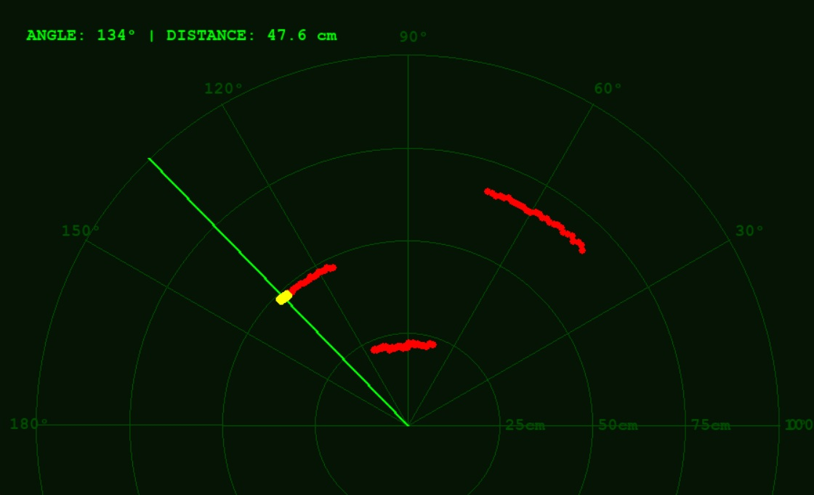

# ultrasonic-radar-system

An Arduino scanning radar that uses a servo and ultrasonic sensor to map environments. Includes  temperature and humidity calibration for increased accuracy and a Python-based GUI for real-time 2D visualization.

