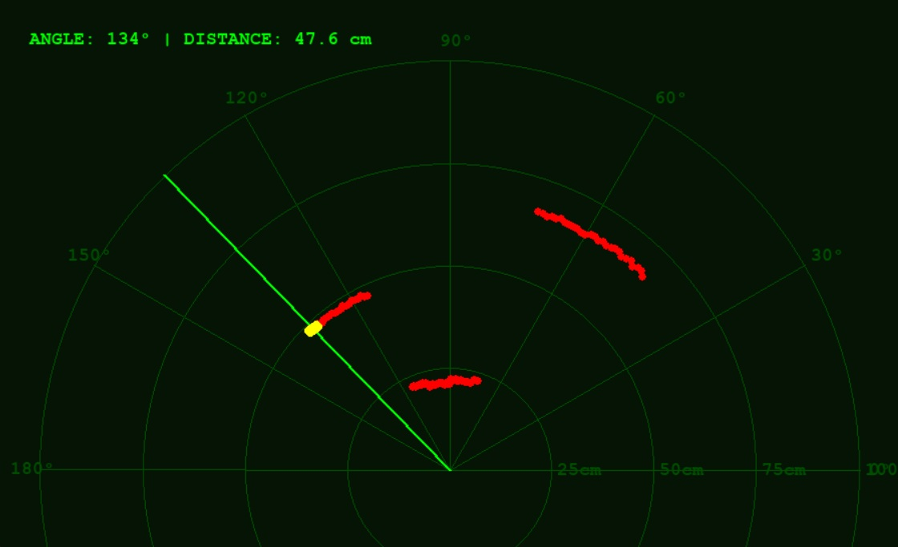

# Ultrasonic radar system

## Overview

This project implements an ultrasonic radar system using an Arduino microcontroller, a rotating ultrasonic sensor, and a Python-based visualization interface.

A servo motor sweeps the ultrasonic sensor across a defined angular range, collecting distance measurements that are transmitted to a computer via serial communication. A Python GUI processes the incoming data and displays a real-time 2D radar-style visualization of the surrounding environment.

To improve measurement accuracy, the system incorporates temperature and humidity compensation, accounting for environmental effects on the speed of sound.

---

## Components

### Hardware

* Arduino microcontroller  
* HC-SR04 ultrasonic distance sensor  
* Servo motor 
* Temperature and humidity sensor 
* Breadboard
* Resistors
* Wires 

### Software

* Arduino firmware for sensor control and data acquisition  
* Python application for data processing and visualization  

---

## Features

* Rotational scanning radar using a servo-mounted ultrasonic sensor  
* Real-time distance measurement across a configurable angular range  
* Environmental calibration using temperature and humidity data  
* Serial communication between the Arduino and the host computer  
* 2D radar-style visualization implemented in Python  

---

## Tools Used

* Arduino IDE – firmware development  
* Python – data processing and visualization  
* PySerial – serial communication with the Arduino  
* PyGame - real-time radar visualization interface
* GitHub – documentation  

---

## What I Learned

* Interfacing ultrasonic sensors with microcontrollers  
* Servo motor control and angular scanning  
* Serial communication between embedded systems and desktop applications  
* Environmental calibration for ultrasonic distance measurements  
* Real-time data visualization using Python   
